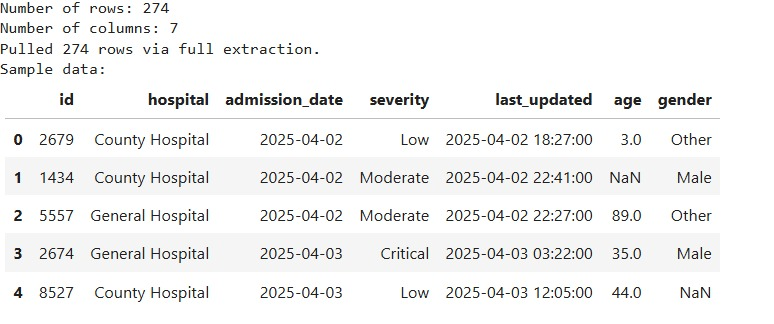

# DSA2040_PROJECT_3: Full,Incremental Data Extraction and Transformation

**Author:** Hana Hailemariam Gashaw

---

## Table of Contents
- [Project Description](#project-description)  
- [Objective](#objective)  
- [Tools Used](#tools-used)  
- [Repository Contents](#repository-contents)  
- [Notebook Description](#notebook-description)  
- [Output Screenshots](#output-screenshots)  
- [How to Reproduce](#how-to-reproduce)   
- [License](#license)  

---

## Project Description

This project demonstrates a simple **ETL (Extract, Transform, Load)** pipeline focusing on **full** and **incremental** data extraction ,transformation and load techniques. It uses simulated hospital admissions data to illustrate how to efficiently extract updated records based on a timestamp checkpoint.

---

## Objective

- Generate sample hospital admissions data spanning multiple days.  
- Implement a **full extraction** process to load all data.  
- Implement an **incremental extraction** process that only pulls data updated since the last extraction timestamp.  
- Maintain and update a checkpoint to keep track of the last extraction time.  
- Apply at least three transformation techniques to both full and incremental datasets to prepare them for analysis.
- Load transformed hospital admission records into a structured and efficient storage format.
- Converting CSV files into Parquet format using Python to optimize for fast access, reduced storage size, and seamless integration into analytical workflows and data platforms.
 

---

## Tools Used

- **Language & Environment:** Python 3.x (Jupyter Notebook)  
- **Libraries:**  
  - `pandas`  
  - `numpy`  
  - `datetime`  
  - `random`
  - `pyarrow`

---

## Repository Contents

| File                              | Description                                                                 |
|-----------------------------------|-----------------------------------------------------------------------------|
| `hospital_admissions.csv`         | Simulated hospital admissions dataset (CSV); same as the fully extracted data |
| `last_extraction.txt`            | Text file storing the last extraction timestamp                            |
| `etl_extract.ipynb`              | Jupyter Notebook for full and incremental extraction                       |
| `.gitignore`                     | Specifies files/folders ignored by Git                                     |
| `LICENSE`                        | MIT license details                                                        |
| `README.md`                      | Project documentation (this file)                                          |
| `hospital_admissions_incremental.csv` | Simulated hospital admissions dataset extracted starting from a specific time period |
| `transformed_full.csv`           | Transformed hospital admissions dataset                                    |
| `transformed_incremental.csv`    | Transformed incremental data                                               |
| `Output_Screenshoots`            | Screenshots from the results of extraction and transformation              |
| `Loaded data`                    | Loaded full and transformed data          |
---

## Notebook Description

This Jupyter Notebooks (`etl_extract.ipynb` and `etl_load.ipynb`) demonstrate **full and incremental data extraction, transformation and load** techniques using a simulated hospital admissions dataset. It showcases how to:

## *etl_extract.ipynb*

### Section_1: Simulated Data Generation  
This notebook begins by generating a **simulated dataset** of hospital admissions spanning 60 days. The dataset includes fields such as patient ID, admission date, hospital name, severity level, and other relevant details.

---

### Section_2: Full Extraction  
A **full extraction** process is implemented to retrieve **all available records** from the generated dataset. This simulates a scenario where the entire data is loaded for the first time or when a complete refresh is required.

---

### Section_3: Incremental Extraction  
The notebook also demonstrates an **incremental extraction** strategy. It filters and retrieves only the **new or updated records** based on a previously stored **timestamp checkpoint**, enabling efficient data updates without redundancy.

#### Checkpoint Management  
A key feature of the incremental process is **checkpoint management**. The notebook reads from a `last_extraction.txt` file that stores the timestamp of the last successful extraction. After each incremental run, this checkpoint is **updated** to ensure that future extractions only include **newly added or modified records** since that time.

---

### Section_4: Transformation – Full Data  
Once the full dataset is extracted, it undergoes several **transformation steps** to prepare the data for analysis. These include:

- **Data Cleaning:** Handling missing values, correcting data types, and removing any duplicates.  
- **Key Restructuring:** Generating **surrogate keys** to uniquely identify records and maintain referential integrity.  
- **Categorization:** Grouping ages into **meaningful categories** such as child, teenager, adult, etc., for easier interpretation and segmentation.

---

### Section_5: Transformation – Incremental Data  
Similarly, the **incrementally extracted data** also undergoes transformation using the same techniques to ensure **consistency with the full dataset**:

- **Data Cleaning:** Ensuring that only valid and clean records are passed on for analysis.  
- **Key Restructuring:** Assigning surrogate keys to new or updated records.  
- **Categorization:** Mapping age values into predefined categories for uniformity.

## *etl_load.ipynb* :Lab_5

In this section, the transformed hospital admission records were loaded and saved in an optimized format for storage and future analysis.

### Loading Method Used

The data was loaded using Python's `pandas` library. The transformed CSV files were read and then converted to **Parquet** format, which offers efficient storage and is well-suited for analytical workflows.

###  Data Files Processed

- `transformed_full.csv` was converted to `full_data.parquet`.
- `transformed_incremental.csv` was converted to `incremental_data.parquet`.

### 🧪 Sample Code

```python
import pandas as pd

# Full transformed data
df_full = pd.read_csv("transformed_full.csv")
df_full.to_parquet("full_data.parquet", index=False)

# Incremental transformed data
df_incremental = pd.read_csv("transformed_incremental.csv")
df_incremental.to_parquet("incremental_data.parquet", index=False)

# Verifying the Parquet files
print(pd.read_parquet("full_data.parquet").head())
print(pd.read_parquet("incremental_data.parquet").head())

**Note:**  
The notebook includes **detailed markdown explanations** for each step, making the extraction and transformation process clear, educational, and easy to follow for students and beginners.
```
### Output Location for loading
The output files were saved in **Parquet** format within the current repository directory. These files are ready to be used for downstream analytics, integration into data platforms, or long-term storage alongside this project.

- `full_data.parquet`
- `incremental_data.parquet`
---

## Output Screenshots

### 1. Full Extraction Output


### 2. Incremental Extraction Output


### 3. Data Cleaning Output


### 4. Key Restructuring Output


### 4. Categorization Output


---

## How to Reproduce

1. **Clone or download this repository.**

2. **Open and run the notebooks `etl_extract.ipynb` and etl_load.ipynb in Jupyter Notebook or JupyterLab.**

3. **Data Source:**

   - The data is **simulated inside the notebook** for learning and demonstration purposes.  
   - The generated and exported files `hospital_admissions.csv` and `hospital_admissions_incremental.csv` contain admissions with hospital name, severity, timestamps, and other relevant details.

---

## License

This project is licensed under the **MIT License**.  
See the [`LICENSE`](LICENSE) file for more details.
